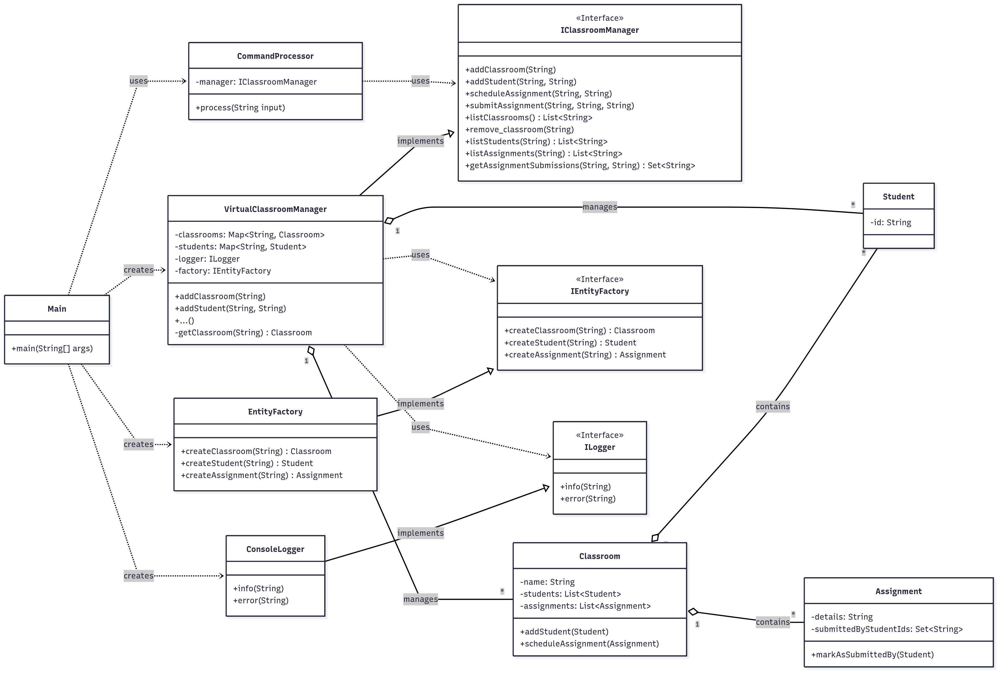

# Educational Initiatives - Coding Challenge Submission

---
## 📂 Project Structure

The repository is organized into two main folders, one for each exercise:

-   **/Exercise1_DesignPatterns**: A Maven project containing six runnable examples, each demonstrating a fundamental software design pattern with a real-world use case.
-   **/Exercise2_ClassroomManager**: A complete, terminal-based Maven application for managing virtual classrooms, students, and assignments.

---
## 🚀 How to Set Up and Run

Both projects are standard Maven projects and are best run using an IDE like IntelliJ IDEA or Eclipse.

### Exercise 1: Design Patterns Demo

1.  Open your IDE (e.g., IntelliJ).
2.  Go to **File -> Open...** and select the **`Exercise1_DesignPatterns`** folder from this repository.
3.  The IDE will automatically recognize it as a Maven project and set it up.
4.  To run any of the six pattern examples, navigate to its demo file (e.g., `src/main/java/com/designpatterns/creational/factory/FactoryDemo.java`), right-click on the file, and select **Run**.

### Exercise 2: Virtual Classroom Manager

1.  Open your IDE (e.g., IntelliJ).
2.  Go to **File -> Open...** and select the **`Exercise2_ClassroomManager/VirtualClassroomManager`** folder.
3.  The IDE will set up the Maven project.
4.  Navigate to the main application file: `src/main/java/com/edtech/classroom/main/Main.java`.
5.  Right-click on the `Main.java` file and select **Run 'Main.main()'**.
6.  The interactive terminal application will start in your IDE's run console, ready to accept commands.

---
##  UML Class Diagram (Exercise 2)

This diagram illustrates the architecture of the Virtual Classroom Manager, showcasing the use of the Facade and Factory patterns and the relationships between the key classes.

---
## ⌨️ Commands for Exercise 2 (Virtual Classroom Manager)

The application accepts the following commands. Arguments that contain spaces (like assignment details) are fully supported.

| Command                                             | Description                                        |
| :-------------------------------------------------- | :------------------------------------------------- |
| `add_classroom <ClassName>`                         | Creates a new virtual classroom.                   |
| `add_student <StudentID> <ClassName>`               | Enrolls a student in a specific classroom.         |
| `schedule_assignment <ClassName> 
`         | Schedules a new assignment for a class.            |
| `submit_assignment <StudentID> <ClassName> 
` | Marks an assignment as submitted by a student.     |
| `list_classrooms`                                   | Lists the names of all created classrooms.         |
| `list_students <ClassName>`                         | Lists all students enrolled in a specific class.   |
| `list_assignments <ClassName>`                      | Lists all assignments scheduled for a specific class. |
| `assignment_status <ClassName> 
`           | Shows which students have submitted an assignment. |
| `remove_classroom <ClassName>`                      | Deletes a classroom.                               |
| `exit`                                              | Shuts down the application.                        |

---
## 💡 Key Design Decisions & Features

### Exercise 1: Design Patterns Implemented

-   **Behavioural Patterns**
    -   **COMMAND:** Encapsulates a request as an object. Demonstrated with a **Restaurant Ordering System**.
    -   **STRATEGY:** Defines a family of algorithms and makes them interchangeable. Demonstrated with an **Image Compression Tool**.
-   **Creational Patterns**
    -   **FACTORY:** Creates objects without exposing creation logic. Demonstrated with a **Document Converter**.
    -   **SINGLETON:** Ensures a class has only one instance. Demonstrated with a **Game Settings Manager**.
-   **Structural Patterns**
    -   **FACADE:** Provides a simplified interface to a complex subsystem. Demonstrated with a **Smart Home Control Panel**.
    -   **ADAPTER:** Makes incompatible interfaces work together. Demonstrated with a **Social Media Sharing Integration**.

### Exercise 2: Architecture and Principles

-   The application is built on the **Facade Pattern** (`VirtualClassroomManager`) to provide a simple and clean interface to the system, and the **Factory Pattern** (`EntityFactory`) to decouple object creation.
-   The code is structured to follow **SOLID principles**, particularly the Single Responsibility Principle and the Dependency Inversion Principle.
-   **Gold Standard** features like a decoupled logging mechanism, custom exception handling, and performance optimization (using `HashMap`) are included as per the requirements.
